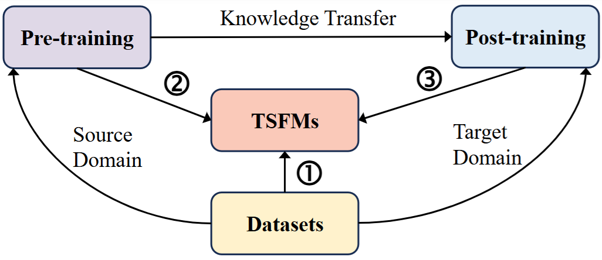
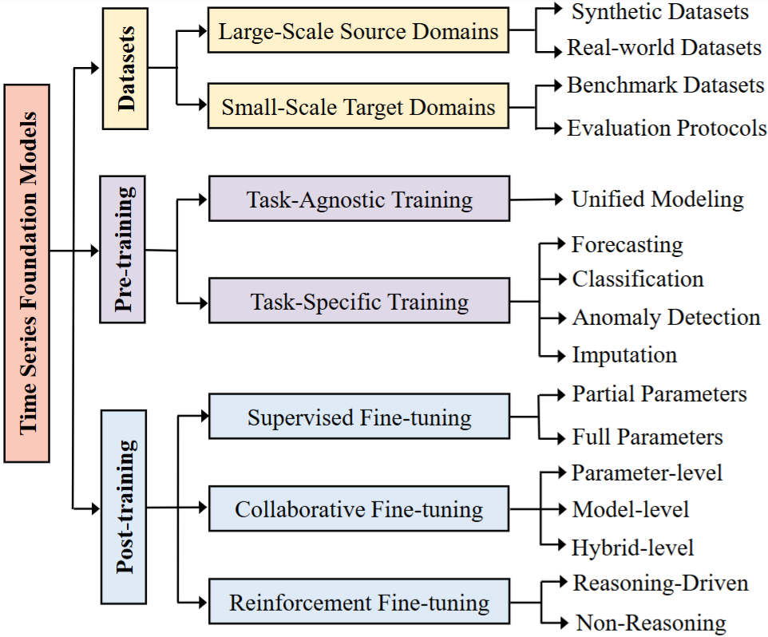

# Awesome Time Series Foundation Models (TSFMs): From Pre-training to Post-training

---

Welcome to the repository accompanying our survey paper **“[From Pre-training to Post-training: A Survey on Time Series Foundation Models](https://www.techrxiv.org/doi/full/10.36227/techrxiv.176978429.90235801/v1).”** This repository curates a comprehensive collection of representative papers and resources on **Time Series Foundation Models (TSFMs)**, with a particular focus on their development pipeline from large-scale **pre-training** to diverse **post-training** paradigms. In line with the central theme of the survey, the collected works are organized around three core aspects: (i) **datasets**, covering large-scale source domains and target-domain evaluation settings; (ii) **pre-training strategies**, including task-agnostic and task-specific learning; and (iii) **post-training methodologies**, such as supervised, collaborative, and reinforcement-based fine-tuning. By systematically organizing existing research along the full lifecycle of TSFMs, this repository aims to serve as a structured reference for researchers and practitioners interested in building, adapting, and deploying foundation models for time series analysis.

<p align="center">
    
</p

---
## 🧭 Overview

Deep learning models have achieved remarkable progress in time series analysis. However, most models require retraining when encountering new domain data, which limits their generalization and cross-domain transferability. While prior efforts have explored adapting large pre-trained language or vision models to time series tasks, modality gaps hinder their ability to capture complex temporal dynamics.
Time Series Foundation Models (TSFMs) trained from scratch have been developed to overcome these limitations, enabling effective knowledge transfer through domain-specific fine-tuning while preserving intrinsic time series characteristics. To this end, this survey offers a comprehensive review of TSFMs trained from scratch, following a unique perspective from pre-training to post-training. Specifically, we present a taxonomy of TSFMs across three dimensions: (1) datasets, discussing the construction of large-scale source domain datasets and the impact of target domains on model evaluation; (2) pre-training, covering task-agnostic and task-specific training paradigms; and (3) post-training, encompassing optimization via supervised, collaborative, and reinforcement-based fine-tuning. Finally, we highlight potential future research directions, including sample quality evaluation, pre-training paradigm design, and agent-based post-training, to advance the development and practical deployment of TSFMs. 

<p align="center">
    
</p>

---

## 📖 Citation
If you find this resource helpful, please consider starring this repository and citing our survey paper:
```
@article{liu2026tsfm,
  title={From Pre-training to Post-training: A Survey on Time Series Foundation Models}, 
  author={Liu, Zhen and  Li, Boyuan and Huang, Hao and Sun, Yanru and Wang, Yucheng and Wu, Min and Ma, Qianli},
  journal={TechRxiv}, 
  pages={1-23},
  year={2026},
  doi={10.36227/techrxiv.176978429.90235801/v1}
}
```

---

## 📑 Contents

- 🗂️ **Time Series Datasets for TSFMs**
  - 🏗️ [Large-Scale Source Domains](#large-scale-source-domains)
  - 🧪 [Small-Scale Target Domains](#small-scale-target-domains)
    - 🔮 [Forecasting](#forecasting)
    - 🏷️ [Classification](#classification)
    - 🛑 [Anomaly Detection](#anomaly-detection)
    - 🧬 [Imputation](#imputation)

- 🧠 **Time Series Pre-training for TSFMs**
  - 🧩 [Task-Agnostic Training](#task-agnostic-training)
  - 🎯 [Task-Specific Training](#task-specific-training)
    - 📈 [Time Series Forecasting](#time-series-forecasting)
    - 🗃️ [Time Series Classification](#time-series-classification)
    - 🚨 [Time Series Anomaly Detection](#time-series-anomaly-detection)
    - 🧵 [Time Series Imputation](#time-series-imputation)

- 🔁 **Time Series Post-training for TSFMs**
  - 🛠️ [Supervised Fine-tuning](#supervised-fine-tuning)
    - 🧱 [Partial Parameters](#partial-parameters)
    - 🧬 [Full Parameters](#full-parameters)
  - 🤝 [Collaborative Fine-tuning](#collaborative-fine-tuning)
    - 🔗 [Parameter-level Collaboration](#parameter-level-collaboration)
    - 🧠 [Model-level Collaboration](#model-level-collaboration)
    - 🧩 [Hybrid-level Collaboration](#hybrid-level-collaboration)
  - 🎮 [Reinforcement Fine-tuning](#reinforcement-fine-tuning)
    - 🧠 [Reasoning-Driven Fine-tuning](#reasoning-driven-fine-tuning)
    - ⚙️ [Non-Reasoning Fine-tuning](#non-reasoning-fine-tuning)

- 📝 [Notes](#notes)

---

## 🗂️ Time Series Datasets for TSFMs
### Large-Scale Source Domains

- **MIRA: Medical Time Series Foundation Model for Real-World Health Data**. *NeurIPS 2025*  
  **Paper**: https://arxiv.org/pdf/2506.07584  
  **Data**: https://github.com/microsoft/MIRA

- **TimesBERT: A BERT-Style Foundation Model for Time Series Understanding**. *ACM MM 2025*  
  **Paper**: https://arxiv.org/abs/2502.21245

- **Time-MoE: Billion-Scale Time Series Foundation Models with Mixture of Experts**. *ICLR 2025*  
  **Paper**: https://arxiv.org/pdf/2409.16040  
  **Data**: https://github.com/Time-MoE/Time-MoE

- **TimePFN: Effective Multivariate Time Series Forecasting with Synthetic Data**. *AAAI 2025*  
  **Paper**: https://ojs.aaai.org/index.php/AAAI/article/view/34288  
  **Data**: https://github.com/egetaga/TimePFN

- **MONSTER: Monash Scalable Time Series Evaluation Repository**. *arXiv 2025*  
  **Paper**: https://arxiv.org/pdf/2502.15122  
  **Data**: https://github.com/Navidfoumani/monster

- **Time-IMM: A Dataset and Benchmark for Irregular Multimodal Multivariate Time Series**. *arXiv 2025*  
  **Paper**: http://arxiv.org/abs/2506.10412  
  **Data**: https://www.kaggle.com/datasets/blacksnail789521/time-imm/data

- **CauKer: Classification Time Series Foundation Models Can Be Pretrained on Synthetic Data Only**. *arXiv 2025*  
  **Paper**: https://arxiv.org/pdf/2508.02879

- **EMind: A Foundation Model for Multi-Task Electromagnetic Signals Understanding**. *arXiv 2025*  
  **Paper**: https://arxiv.org/pdf/2508.18785  
  **Data**: https://github.com/GabrielleTse/EMind

- **Mitigating Data Scarcity in Time Series Analysis: A Foundation Model with Series-Symbol Data Generation**. *arXiv 2025*  
  **Paper**: https://arxiv.org/pdf/2502.15466

- **Towards Foundation Models for Zero-Shot Time Series Anomaly Detection: Leveraging Synthetic Data and Relative Context Discrepancy**. *arXiv 2025*  
  **Paper**: https://arxiv.org/pdf/2509.21190  
  **Data**: https://github.com/thu-sail-lab/Time-RCD

- **UniTS: A Unified Multi-Task Time Series Model**. *NeurIPS 2024*  
  **Paper**: https://proceedings.neurips.cc/paper_files/paper/2024/file/fe248e22b241ae5a9adf11493c8c12bc-Paper-Conference.pdf  
  **Data**: https://github.com/mims-harvard/UniTS

- **NuTime: Numerically Multi-Scaled Embedding for Large-Scale Time-Series Pretraining**. *TMLR 2024*  
  **Paper**: https://arxiv.org/pdf/2310.07402

- **Chronos: Learning the Language of Time Series**. *TMLR 2024*  
  **Paper**: https://arxiv.org/pdf/2403.07815

- **MOMENT: A Family of Open Time-Series Foundation Models**. *ICML 2024*  
  **Paper**: https://arxiv.org/pdf/2402.03885  
  **Data**: https://github.com/moment-timeseries-foundation-model/moment-research

- **Timer: Generative Pre-trained Transformers Are Large Time Series Models**. *ICML 2024*  
  **Paper**: https://arxiv.org/pdf/2402.02368  
  **Data**: https://github.com/thuml/Large-Time-Series-Model

- **A Decoder-Only Foundation Model for Time-Series Forecasting**. *ICML 2024*  
  **Paper**: https://arxiv.org/pdf/2409.16040

- **ForecastPFN: Synthetically-Trained Zero-Shot Forecasting**. *NeurIPS 2023*  
  **Paper**: https://proceedings.neurips.cc/paper_files/paper/2023/file/0731f0e65559059eb9cd9d6f44ce2dd8-Paper-Conference.pdf  
  **Data**: https://github.com/abacusai/forecastpfn

- **BuildingsBench: A Large-Scale Dataset of 900k Buildings for Short-Term Load Forecasting**. *NeurIPS 2023 (Datasets and Benchmarks)*  
  **Paper**: https://proceedings.neurips.cc/paper_files/paper/2023/file/3f17bf868966df01ca125e5bbc9ee24e-Paper-Datasets_and_Benchmarks.pdf  
  **Data**: https://github.com/NREL/BuildingsBench

- **Lag-LLaMA: Towards Foundation Models for Time Series Forecasting**. *NeurIPS Workshop 2023*  
  **Paper**: https://openreview.net/pdf?id=jYluzCLFDM

- **Pushing the Limits of Pre-Training for Time Series Forecasting in the CloudOps Domain**. *arXiv 2023*  
  **Paper**: https://arxiv.org/pdf/2310.05063

- **MIMIC-IV-ECG: Diagnostic Electrocardiogram Matched Subset**. *Type: dataset 2023*  
  **Paper**: https://physionet.org/content/mimic-iv-ecg/1.0/files/p1187/p11875773/  
  **Data**: https://physionet.org/content/mimic-iv-ecg/1.0/
  
- **Transfer Learning for Time Series Classification Using Synthetic Data Generation**. *ISCSCML 2022*  
  **Paper**: https://arxiv.org/pdf/2207.07897  
  **Data**: https://github.com/YR234/TL-for-TSC

---

### Small-Scale Target Domains

#### Forecasting

- **ETTh1, ETTh2, ETTm1, ETTm2 Datasets**  
  **Paper**: https://ojs.aaai.org/index.php/AAAI/article/download/17325/17132  
  **Data**: https://github.com/zhouhaoyi/Informer2020

- **Electricity, Traffic, Weather, Exchange Rate, and ILI Datasets**  
  **Paper**: https://arxiv.org/pdf/2210.02186  
  **Data**: https://github.com/thuml/Time-Series-Library

- **MIMIC-IV: A Freely Accessible Electronic Health Record Dataset**. *Scientific Data 2023*  
  **Paper**: https://www.nature.com/articles/s41597-022-01899-x  
  **Data**: https://physionet.org/content/mimiciv/1.0/

- **MIMIC-III: A Freely Accessible Critical Care Database**. *Scientific Data 2016*  
  **Paper**: https://www.nature.com/articles/sdata201635  
  **Data**: https://physionet.org/content/mimiciii/1.4/

- **Predicting In-Hospital Mortality of ICU Patients: The PhysioNet/Computing in Cardiology Challenge 2012**. *Computing in Cardiology 2012*  
  **Paper**: https://www.ncbi.nlm.nih.gov/pmc/articles/PMC3965265/  
  **Data**: https://physionet.org/content/challenge-2012/1.0.0/

- **Localization Data for Person Activity**  
  **Data**: https://archive.ics.uci.edu/dataset/196/localization+data+for+person+activity

- **Long-Term Daily and Monthly Climate Records from Stations Across the Contiguous United States (U.S. Historical Climatology Network)**  
  **Data**: https://www.osti.gov/biblio/1394920

---

#### Classification

- **The UCR Time Series Classification Archive**. *IEEE/CAA Journal of Automatica Sinica 2019*  
  **Paper**: https://arxiv.org/pdf/1810.07758  
  **Data**: https://www.cs.ucr.edu/~eamonn/time_series_data_2018/UCRArchive_2018.zip

- **The UEA Multivariate Time Series Classification Archive**. *arXiv 2018*  
  **Paper**: https://arxiv.org/pdf/1811.00075  
  **Data**: http://www.timeseriesclassification.com/Downloads/Archives/Multivariate2018_arff.zip

- **SleepEEG, Epilepsy, FD-A, FD-B, HAR, Gesture, ECG, and EMG Datasets**  
  **Paper**: https://github.com/ZLiu21/UniShape  
  **Data**: https://drive.google.com/file/d/1J2AiL2KgDpZGprnWfH-cqza-Dih25p5z/view

- **Early Prediction of Sepsis From Clinical Data: The PhysioNet/Computing in Cardiology Challenge 2019**. *Critical Care Medicine 2020*  
  **Paper**: https://journals.lww.com/ccmjournal/fulltext/2020/02000/early_prediction_of_sepsis_from_clinical_data__the.10.aspx  
  **Data**: https://physionet.org/content/challenge-2019/1.0.0/

- **MIMIC-III: A Freely Accessible Critical Care Database**. *Scientific Data 2016*  
  **Paper**: https://www.nature.com/articles/sdata201635  
  **Data**: https://physionet.org/content/mimiciii/1.4/

- **Predicting In-Hospital Mortality of ICU Patients: The PhysioNet/Computing in Cardiology Challenge 2012**. *Computing in Cardiology 2012*  
  **Paper**: https://www.ncbi.nlm.nih.gov/pmc/articles/PMC3965265/  
  **Data**: https://physionet.org/content/challenge-2012/1.0.0/

- **Introducing a New Benchmarked Dataset for Activity Monitoring**. *ISWC 2012*  
  **Paper**: http://ieeexplore.ieee.org/document/6246152/  
  **Data**: http://www.pamap.org/demo.html

---

#### Anomaly Detection

- **The UCR Time Series Anomaly Detection Archive**. *2020*  
  **Paper**: https://arxiv.org/pdf/2009.13807  
  **Data**: https://wu.renjie.im/research/anomaly-benchmarks-are-flawed/

- **MSL, SMAP, PSM, SMD, SWaT, NIPS-TS-SWAN, and NIPS-TS-GECCO Datasets**  
  **Paper**: https://arxiv.org/pdf/2506.18046  
  **Data**: https://github.com/decisionintelligence/TAB

---

#### Imputation

- **BeijingAir Dataset**  
  **Paper**: https://faculty.ecnu.edu.cn/_upload/article/files/28/df/b3c3371449d99fa8e41d1592e78c/4dd93651-78d7-4341-8486-d4bbec24af64.pdf  
  **Data**: http://weather.nocrew.org/

- **PeMS Dataset**  
  **Paper**: https://arxiv.org/pdf/2006.02031  
  **Data**: https://github.com/Wensi-Tang/DPSN

- **ETT and Traffic Datasets**  
  **Paper**: https://arxiv.org/pdf/2210.02186  
  **Data**: https://github.com/thuml/Time-Series-Library

- **The UCR Time Series Classification Archive**. *IEEE/CAA Journal of Automatica Sinica 2019*  
  **Paper**: https://arxiv.org/pdf/1810.07758  
  **Data**: https://www.cs.ucr.edu/~eamonn/time_series_data_2018/UCRArchive_2018.zip

- **The UEA Multivariate Time Series Classification Archive**. *arXiv 2018*  
  **Paper**: https://arxiv.org/pdf/1811.00075  
  **Data**: http://www.timeseriesclassification.com/Downloads/Archives/Multivariate2018_arff.zip

- **Predicting In-Hospital Mortality of ICU Patients: The PhysioNet/Computing in Cardiology Challenge 2012**. *Computing in Cardiology 2012*  
  **Paper**: https://www.ncbi.nlm.nih.gov/pmc/articles/PMC3965265/  
  **Data**: https://physionet.org/content/challenge-2012/1.0.0/
  
---

## 🧠 Time Series Pre-training for TSFMs

### Task-Agnostic Training

- **TimesBERT: A BERT-Style Foundation Model for Time Series Understanding**. *ACM MM 2025*  
  **Paper**: https://arxiv.org/abs/2502.21245

- **Boosting Masked ECG-Text Auto-Encoders as Discriminative Learners**. *ICML 2025*  
  **Paper**: https://arxiv.org/pdf/2410.02131  
  **Code**: https://github.com/manhph2211/D-BETA

- **Federated Foundation Models on Heterogeneous Time Series**. *AAAI 2025*  
  **Paper**: https://ojs.aaai.org/index.php/AAAI/article/download/33739/35894  
  **Code**: https://github.com/shengchaochen82/FFTS

- **WirelessGPT: A Generative Pre-Trained Multi-Task Learning Framework for Wireless Communication**. *IEEE Network 2025*  
  **Paper**: https://arxiv.org/pdf/2502.06877

- **TSPulse: Dual-Space Tiny Pre-Trained Models for Rapid Time-Series Analysis**. *arXiv 2025*  
  **Paper**: https://arxiv.org/pdf/2505.13033  
  **Code**: https://huggingface.co/ibm-granite/granite-timeseries-tspulse-r1

- **BenchECG and xECG: A Benchmark and Baseline for ECG Foundation Models**. *arXiv 2025*  
  **Paper**: https://arxiv.org/pdf/2509.10151

- **EMind: A Foundation Model for Multi-Task Electromagnetic Signals Understanding**. *arXiv 2025*  
  **Paper**: https://arxiv.org/pdf/2508.18785  
  **Code**: https://github.com/GabrielleTse/EMind

- **UniTS: A Unified Multi-Task Time Series Model**. *NeurIPS 2024*  
  **Paper**: https://proceedings.neurips.cc/paper_files/paper/2024/file/fe248e22b241ae5a9adf11493c8c12bc-Paper-Conference.pdf  
  **Code**: https://github.com/mims-harvard/UniTS

- **NuTime: Numerically Multi-Scaled Embedding for Large-Scale Time-Series Pretraining**. *TMLR 2024*  
  **Paper**: https://arxiv.org/pdf/2310.07402  
  **Code**: https://github.com/chenguolin/NuTime

- **MOMENT: A Family of Open Time-Series Foundation Models**. *ICML 2024*  
  **Paper**: https://arxiv.org/pdf/2402.03885  
  **Code**: https://github.com/moment-timeseries-foundation-model/moment-research

- **Timer: Generative Pre-Trained Transformers Are Large Time Series Models**. *ICML 2024*  
  **Paper**: https://arxiv.org/pdf/2402.02368  
  **Code**: https://github.com/thuml/Large-Time-Series-Model

---

### Task-Specific Training

#### Time Series Forecasting

- **Sundial: A Family of Highly Capable Time Series Foundation Models**. *ICML 2025*  
  **Paper**: https://openreview.net/forum?id=LO7ciRpjI5  
  **Code**: https://github.com/thuml/Sundial

- **Time-MoE: Billion-Scale Time Series Foundation Models with Mixture of Experts**. *ICLR 2025*  
  **Paper**: https://openreview.net/forum?id=e1wDDFmlVu  
  **Code**: https://github.com/Time-MoE/Time-MoE

- **Timer-XL: Long-Context Transformers for Unified Time Series Forecasting**. *ICLR 2025*  
  **Paper**: https://openreview.net/forum?id=KMCJXjlDDr  
  **Code**: https://github.com/thuml/Timer-XL

- **Chronos-2: From Univariate to Universal Forecasting**. *arXiv 2025*  
  **Paper**: http://arxiv.org/abs/2510.15821  
  **Code**: https://github.com/amazon-science/chronos-forecasting

- **Mitigating Data Scarcity in Time Series Analysis: A Foundation Model with Series-Symbol Data Generation**. *arXiv 2025*  
  **Paper**: https://arxiv.org/abs/2502.15466  
  **Code**: https://github.com/wwhenxuan/S2Generator

- **MIRA: Medical Time Series Foundation Model for Real-World Health Data**. *arXiv 2025*  
  **Paper**: http://arxiv.org/abs/2506.07584

- **Generative Pretrained Hierarchical Transformer for Time Series Forecasting**. *KDD 2024*  
  **Paper**: https://doi.org/10.1145/3637528.3671855  
  **Code**: https://github.com/icantnamemyself/GPHT

- **Large Pre-Trained Time Series Models for Cross-Domain Time Series Analysis Tasks**. *NeurIPS 2024*  
  **Paper**: https://proceedings.neurips.cc/paper_files/paper/2024/hash/662dcc5c2b9aca77b2a0ec8a98aefae9-Abstract-Conference.html  
  **Code**: https://github.com/AdityaLab/LPTM

- **UP2ME: Univariate Pre-Training to Multivariate Fine-Tuning as a General-Purpose Framework for Multivariate Time Series Analysis**. *ICML 2024*  
  **Paper**: https://proceedings.mlr.press/v235/zhang24al.html  
  **Code**: https://github.com/Thinklab-SJTU/UP2ME

- **Unified Training of Universal Time Series Forecasting Transformers**. *ICML 2024*  
  **Paper**: https://proceedings.mlr.press/v235/woo24a.html  
  **Code**: https://github.com/SalesforceAIResearch/uni2ts

- **A Decoder-Only Foundation Model for Time-Series Forecasting**. *ICML 2024*  
  **Paper**: https://proceedings.mlr.press/v235/das24c.html  
  **Code**: https://github.com/google-research/timesfm

- **TEMPO: Prompt-Based Generative Pre-Trained Transformer for Time Series Forecasting**. *ICLR 2024*  
  **Paper**: https://openreview.net/forum?id=YH5w12OUuU  
  **Code**: https://github.com/DC-research/TEMPO

- **FlexTSF: A Universal Forecasting Model for Time Series with Variable Regularities**. *arXiv 2024*  
  **Paper**: http://arxiv.org/abs/2410.23160  
  **Code**: https://github.com/jingge326/FlexTSF

- **Lag-LLaMA: Towards Foundation Models for Probabilistic Time Series Forecasting**. *arXiv 2024*  
  **Paper**: http://arxiv.org/abs/2310.08278  
  **Code**: https://github.com/time-series-foundation-models/lag-llama

- **PrimeNet: Pre-Training for Irregular Multivariate Time Series**. *AAAI 2023*  
  **Paper**: https://ojs.aaai.org/index.php/AAAI/article/view/25876  
  **Code**: https://github.com/ranakroychowdhury/PrimeNet
  
---

#### Time Series Classification

- **A Unified Shape-Aware Foundation Model for Time Series Classification**. *AAAI 2026*  
  **Paper**: https://www.arxiv.org/abs/2601.06429  
  **Code**: https://github.com/ZLiu21/UniShape

- **ECGFM: A Foundation Model for ECG Analysis Trained on a Multi-Center Million-ECG Dataset**. *Information Fusion 2025*  
  **Paper**: https://www.sciencedirect.com/science/article/abs/pii/S1566253525004361

- **Mantis: Lightweight Calibrated Foundation Model for User-Friendly Time Series Classification**. *arXiv 2025*  
  **Paper**: https://arxiv.org/pdf/2502.15637  
  **Code**: https://github.com/vfeofanov/mantis

- **ExChanGeAI: An End-to-End Platform and Efficient Foundation Model for Electrocardiogram Analysis and Fine-Tuning**. *arXiv 2025*  
  **Paper**: https://arxiv.org/pdf/2503.13570

- **UniMTS: Unified Pre-Training for Motion Time Series**. *NeurIPS 2024*  
  **Paper**: https://proceedings.neurips.cc/paper_files/paper/2024/file/c290d4373c495b2cad0625d6288260f0-Paper-Conference.pdf  
  **Data**: https://github.com/xiyuanzh/UniMTS

- **Finding Foundation Models for Time Series Classification with a Pretext Task**. *PAKDD 2024*  
  **Paper**: https://arxiv.org/pdf/2311.14534  
  **Code**: https://github.com/MSD-IRIMAS/DomainFoundationModelsTSC

- **Repurposing Foundation Models for Generalizable Medical Time Series Classification**. *arXiv 2024*  
  **Paper**: https://arxiv.org/pdf/2410.03794

- **Examining the Effect of Pre-Training on Time Series Classification**. *arXiv 2023*  
  **Paper**: https://arxiv.org/pdf/2309.05256

- **Transfer Learning for Time Series Classification Using Synthetic Data Generation**. *ISCSCML 2022*  
  **Paper**: https://arxiv.org/pdf/2207.07897  
  **Code**: https://github.com/YR234/TL-for-TSC

---

#### Time Series Anomaly Detection

- **Towards a General Time Series Anomaly Detector with Adaptive Bottlenecks and Dual Adversarial Decoders**. *ICLR 2025*  
  **Paper**: https://arxiv.org/pdf/2405.15273  
  **Code**: https://github.com/decisionintelligence/DADA

- **Are Time Series Foundation Models Good for Energy Anomaly Detection?**. *ACM ICFSES 2025*  
  **Paper**: https://dl.acm.org/doi/pdf/10.1145/3679240.3734633

- **RATFM: Retrieval-Augmented Time Series Foundation Model for Anomaly Detection**. *arXiv 2025*  
  **Paper**: https://arxiv.org/pdf/2506.02081

- **Towards Foundation Auto-Encoders for Time-Series Anomaly Detection**. *arXiv 2025*  
  **Paper**: https://arxiv.org/pdf/2507.01875

- **Time Series Foundational Models: Their Role in Anomaly Detection and Prediction**. *arXiv 2024*  
  **Paper**: https://arxiv.org/pdf/2412.19286  
  **Code**: https://github.com/smtmnfg/TSFM

---

#### Time Series Imputation

- **Mitigating Data Scarcity in Time Series Analysis: A Foundation Model with Series-Symbol Data Generation**. *arXiv 2025*  
  **Paper**: https://arxiv.org/abs/2502.15466  
  **Code**: https://github.com/wwhenxuan/S2Generator

- **Timer: Generative Pre-Trained Transformers Are Large Time Series Models**. *ICML 2024*  
  **Paper**: https://proceedings.mlr.press/v235/liu24cb.html  
  **Code**: https://github.com/thuml/Large-Time-Series-Model

- **MOMENT: A Family of Open Time-Series Foundation Models**. *ICML 2024*  
  **Paper**: https://proceedings.mlr.press/v235/goswami24a.html  
  **Code**: https://github.com/moment-timeseries-foundation-model/moment-research

- **PrimeNet: Pre-Training for Irregular Multivariate Time Series**. *AAAI 2023*  
  **Paper**: https://ojs.aaai.org/index.php/AAAI/article/view/25876  
  **Code**: https://github.com/ranakroychowdhury/PrimeNet

---

## 🔁 Time Series Post-training for TSFMs

### Supervised Fine-tuning

#### Partial Parameters
- **Multi-Scale Finetuning for Encoder-based Time Series Foundation Models**. *NeurIPS 2025*  
  **Paper**: https://arxiv.org/pdf/2506.14087  
  **Code**: https://github.com/zqiao11/MSFT

- **Convtimenet: A pre-trained deep convolutional neural network for time series classification**. *IJCNN 2019*  
  **Paper**: https://arxiv.org/pdf/1904.12546  

#### Full Parameters
- **Mantis: Lightweight Calibrated Foundation Model for User-Friendly Time Series Classification**. *arXiv 2025*  
  **Paper**: https://arxiv.org/pdf/2502.15637  
  **Code**: https://github.com/vfeofanov/mantis

- **UniTS: A Unified Multi-Task Time Series Model**. *NeurIPS 2024*  
  **Paper**: https://proceedings.neurips.cc/paper_files/paper/2024/hash/fe248e22b241ae5a9adf11493c8c12bc-Abstract-Conference.html  
  **Code**: https://github.com/mims-harvard/UniTS

- **NuTime: Numerically Multi-Scaled Embedding for Large-Scale Time-Series Pretraining**. *TMLR 2024*  
  **Paper**: https://arxiv.org/pdf/2310.07402  
  **Code**: https://github.com/chenguolin/NuTime

---

### Collaborative Fine-tuning

#### Parameter-level Collaboration
- **H-Tuning: Toward Low-Cost and Efficient ECG-based Cardiovascular Disease Detection with Pre-Trained Models**. *ICML 2025*  
  **Paper**: https://openreview.net/pdf?id=RLu1QIPiVr  
  **Code**: https://github.com/KAZABANA/H-Tuning

- **AdaPTS: Adapting Univariate Foundation Models to Probabilistic Multivariate Time Series Forecasting**. *ICML 2025*  
  **Paper**: https://arxiv.org/pdf/2502.10235  
  **Code**: https://github.com/abenechehab/AdaPTS

- **User-Friendly Foundation Model Adapters for Multivariate Time Series Classification**. *ICDEW 2025*  
  **Paper**: https://helios2.mi.parisdescartes.fr/~themisp/publications/multisa25.pdf

- **Mixture of Low-Rank Adaptation with Partial Parameter Sharing for Time Series Forecasting**. *arXiv 2025*  
  **Paper**: https://arxiv.org/pdf/2505.17872  
  **Code**: https://anonymous.4open.science/r/MoLA-BC92/README.md

- **Low-Rank Adaptation of Time Series Foundational Models for Out-of-Domain Modality Forecasting**. *ICMI 2024*  
  **Paper**: https://arxiv.org/pdf/2405.10216

- **Uncertainty-Aware Fine-Tuning on Time Series Foundation Models for Anomaly Detection**. *OpenReview 2024*  
  **Paper**: https://openreview.net/pdf?id=W1wlE4bPqP

#### Model-level Collaboration
- **TRACE: Grounding Time Series in Context for Multimodal Embedding and Retrieval**. *NeurIPS 2025*  
  **Paper**: https://arxiv.org/pdf/2506.09114  
  **Code**: https://github.com/Graph-and-Geometric-Learning/TRACE-Multimodal-TSEncoder

- **ChatTime: A Unified Multimodal Time Series Foundation Model Bridging Numerical and Textual Data**. *AAAI 2025*  
  **Paper**: https://ojs.aaai.org/index.php/AAAI/article/view/33384/35539  
  **Code**: https://github.com/ForestsKing/ChatTime

- **Calf: Aligning Large Language Models for Time Series Forecasting via Cross-Modal Fine-Tuning**. *AAAI 2025*  
  **Paper**: https://ojs.aaai.org/index.php/AAAI/article/view/34082/36237  
  **Code**: https://github.com/Hank0626/CALF

- **Anomaly Detection in Medical Data via Multimodal Foundation Models**. *Frontiers in Bioengineering and Biotechnology 2025*  
  **Paper**: https://www.frontiersin.org/journals/bioengineering-and-biotechnology/articles/10.3389/fbioe.2025.1644697/pdf

- **Multimodal Pretraining of Medical Time Series and Clinical Notes**. *Machine Learning for Health 2023*  
  **Paper**: https://proceedings.mlr.press/v225/king23a/king23a.pdf  
  **Code**: https://github.com/kingrc15/multimodal-clinical-pr

#### Hybrid-level Collaboration
- **Foundation Model Knowledge Distillation for Battery Capacity Degradation Forecasting**. *arXiv 2025*  
  **Paper**: https://arxiv.org/pdf/2412.11276  
  **Code**: https://github.com/sjtu-chan-joey/Battery-Timer

- **Wearable Accelerometer Foundation Models for Health via Knowledge Distillation**. *arXiv 2024*  
  **Paper**: https://arxiv.org/pdf/2412.11276

- **Knowledge Distillation from Multiple Foundation Models for End-to-End Speech Recognition**. *arXiv 2023*  
  **Paper**: https://arxiv.org/pdf/2303.10917

---

### Reinforcement Fine-tuning

#### Reasoning-Driven Fine-tuning
- **Time-R1: Towards Comprehensive Temporal Reasoning in Large Language Models**. *arXiv 2025*  
  **Paper**: https://arxiv.org/abs/2505.13508  
  **Code**: https://github.com/ulab-uiuc/Time-R1

- **Time Series Forecasting as Reasoning: A Slow-Thinking Approach with Reinforced Large Language Models**. *arXiv 2025*  
  **Paper**: https://arxiv.org/abs/2506.10630  
  **Code**: https://github.com/lqzxt/Time-R1

- **TimeMaster: Training Time-Series Multimodal Large Language Models to Reason via Reinforcement Learning**. *arXiv 2025*  
  **Paper**: https://arxiv.org/abs/2506.13705  
  **Code**: https://github.com/langfengQ/TimeMaster

- **Trading-R1: Financial Trading with Large Language Model Reasoning via Reinforcement Learning**. *arXiv 2025*  
  **Paper**: https://arxiv.org/abs/2509.11420  
  **Code**: https://github.com/TauricResearch/Trading-R1


#### Non-Reasoning Fine-tuning
- **LangTime: A Language-Guided Unified Model for Time Series Forecasting with Proximal Policy Optimization**. *ICML 2025*  
  **Paper**: https://arxiv.org/abs/2503.08271  
  **Code**: https://github.com/niuwz/LangTime

- **TimeHF: Billion-Scale Time Series Models Guided by Human Feedback**. *arXiv 2025*  
  **Paper**: https://arxiv.org/abs/2501.15942


---

## Notes

- Contributions and corrections are welcome.
